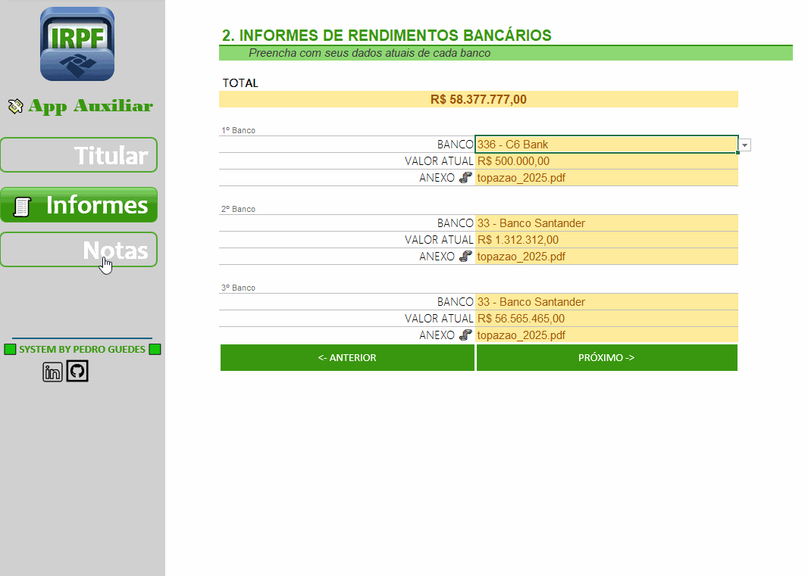
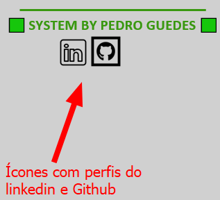
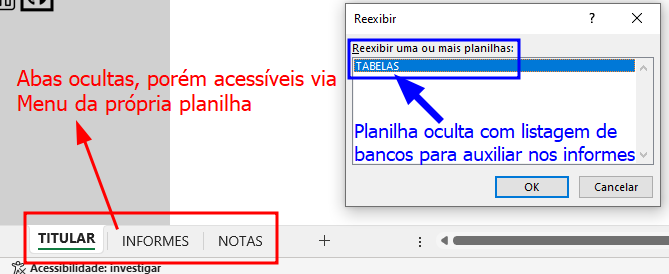

  

# Reposítório criado para registro e entrega de projeto para o curso "Criando Um Organizador de Declaração de Imposto de Renda"
## ÍNDICE
 <a href="#section1" style="text-decoration:none;">**1.** 📊 Apresentação de ferramenta criada</a>

 <a href="#section2" style="text-decoration:none;">**2.** ⚙ Recursos e funcionalidades disponíveis</a>

 <a href="#section3" style="text-decoration:none;">**3.** ⏯️ Curso que motivou a criação do repositório</a>

 <a href="#section4" style="text-decoration:none;">**4.**  Autor | Menções honrosas</a>

 

## 
 1. 📊 Apresentação de ferramenta criada

 

## 
 2. ⚙ Recursos e automações disponíveis
⚠️ **Observação:** Apenas os campos que precisam ser preenchidos são editáveis, os demais campos estão protegidas (bloqueadas) para edição por padrão.
- **Ícones disponíveis com links diretamente para redes do autor**

- **Listagem de Bancos em planilha oculta (disponível na parte de informes)**

 

## 
 3. ⏯️ Curso que motivou a criação do repositório
- **🏆 [DioBootCamp](https://web.dio.me/track/santander-excel-com-inteligencia-artificial):** BootCamp oferecido em parceria entre [SantanderAcademy](https://app.santanderopenacademy.com/pt-BR/program/excel-com-inteligencia-artificial) e a plataforma de estudos Dio.

 

## 
 4.  Autor

|  [ Pedro Guedes](https://github.com/pedroaugustorgg) |
| :---: |

## 🧾 Menções honrosas - Fontes de inspiração

 - **📋 [EstudoGit](https://github.com/pedroaugustorgg/EstudoGit):**  Modelo inspirado de documentação
 - **💡 [Smartsheet](https://docs.google.com/spreadsheets/d/1BBZk3Frjn-9VR3O2s9g5YrCWvv9CSFPgK8Zb2GKn5bw/edit):** Modelo de planilha para planejamento financeiro anual doméstico.
